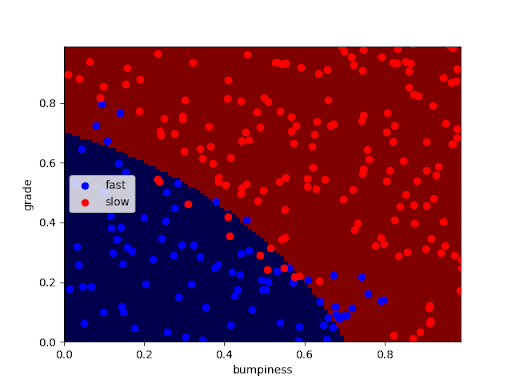

# Quizz

To find the **ClassifyNB.py** script that you need to update for the quiz, you can click on the dropdown in the classroom code editor to get a list of files that will be used.

In the quiz that follows, the line that reads
pred = clf.predict(features_test)
is not necessary for drawing the decision boundary, at least as we've written the code.

However, the whole point of making a classifier is that you can make predictions with it, so be sure to keep it in mind since you'll be using it in the quiz after this one.

